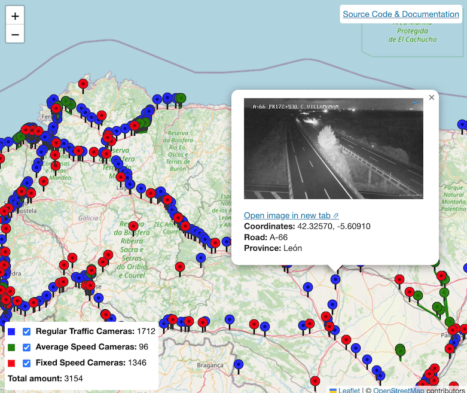

# spanish-dgt-cameras

This repo stores a website that shows the cameras which the Spanish Road Department want us to know about.

CCTV cameras api endpoints:
  - JSON https://www.dgt.es/.content/.assets/json/camaras.json
  - XML https://infocar.dgt.es/datex2/dgt/PredefinedLocationsPublication/camaras/content.xml

Speed cameras api endpoint:
  - XML https://infocar.dgt.es/datex2/dgt/PredefinedLocationsPublication/radares/content.xml

## Sources
- https://nap.dgt.es/organization/dgt
- https://www.dgt.es/conoce-el-estado-del-trafico/camaras-de-trafico/